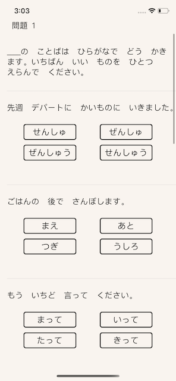

# Tameshi-JLPT (Work in Progress)
- Native iOS mobile app using UIKit and Swift 5 in Xcode 12.

## About the title & Overview
試し (read as "tameshi") is a Japanese word that means "trial; test". 

The JLPT is short for Japanese Language Proficiency Test. It is held in Japan and abroad to evaluate and certify language proficiency of Japanese language learners. There are five levels N5 - N1 (beginner to advanced). 

There's an official print copy of the practice book sold in the US but it's not readily available. An abridged sample test is available on the official website but it’s slow and not compatible with mobile browsers, in addition the question bank for the abridged version is also static and doesn’t change. A full sample test is also available on the site but the sections are formatted in PDF and downloadable audio files only.

## The Goal of this Project
The main feature of the app is to closely simulate a genuine test-taking experience. The main objective of the app is to help the user to become familiar with the formatting of the test, as well as, a general self-assessment of their own skills to pinpoint any areas they’d like to strengthen.

## WIP Features 
- N5 Vocabulary Section, Section 1 out 4 - Kanji Reading Multiple Choice
- Keep track of the state of the selected answer button
- Check if the selected answer is correct or not

## Future Features
- present an alert to user with tally of correct answers
- keep track of best scores and recent scores
- timed sessions

## Screenshots (more coming soon!)

